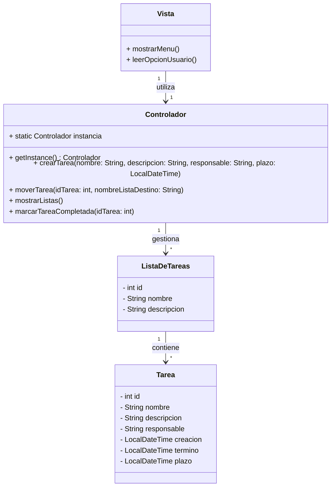

# Enunciado: Aplicación de Consola para Gestionar Tableros Kanban

El objetivo de este ejercicio es crear una aplicación básica de consola en Java para gestionar tableros kanban. El sistema debe estructurarse siguiendo un patrón de diseño MVC (Modelo-Vista-Controlador), distribuyendo el código en tres paquetes:

- **modelo**: contiene las clases que representan la lógica de datos.
- **controlador**: contiene la lógica para gestionar las operaciones del sistema.
- **vista**: contiene la interfaz de usuario en la consola para interactuar con el usuario.

## Requisitos y Descripción del Problema

La aplicación debe gestionar un tablero kanban mediante el uso de clases para representar tareas y listas de tareas. Estas listas de tareas se utilizan para modelar los diferentes estados de un tablero kanban típico, como "ToDo" (Por Hacer), "Doing" (En Progreso), "Done" (Hecho) y "Backlog".

### Paquetes y Clases Requeridas

1. **Paquete modelo**: Las clases de este paquete deben lanzar excepciones para manejar errores relacionados con la gestión de tareas, como identificadores duplicados, listas inexistentes o fechas no válidas.
    - **Clase `Tarea`**: Esta clase representa una tarea en el tablero kanban y debe contener los siguientes atributos:
        - `int id`: Identificador único de la tarea.
        - `String nombre`: El nombre o título de la tarea.
        - `String descripcion`: Una breve descripción de la tarea.
        - `String responsable`: El nombre de la persona responsable de completar la tarea.
        - `LocalDateTime creacion`: La fecha y hora en la que se creó la tarea.
        - `LocalDateTime termino`: La fecha y hora en la que se completó la tarea (si corresponde).
        - `LocalDateTime plazo`: La fecha y hora límite para completar la tarea.

    - **Clase `ListaDeTareas`**: Esta clase representa una lista de tareas. Debe contener los siguientes atributos:
        - `int id`: Identificador único de la lista de tareas.
        - `String nombre`: Nombre de la lista de tareas (por ejemplo, "ToDo", "Doing", "Done", "Backlog").
        - `String descripcion`: Descripción de la lista, proporcionando más contexto sobre su propósito.
       
2. **Paquete controlador**:
    - El controlador debe implementarse siguiendo el patrón Singleton para asegurar que solo exista una única instancia que gestione las tareas y listas de tareas en toda la aplicación. Se encarga de la gestión de las tareas y listas de tareas, proporcionando servicios a la vista. Las operaciones que se deben incluir son:
        - Crear una nueva tarea y agregarla a una lista de tareas.
        - Mover una tarea entre las diferentes listas (por ejemplo, de "ToDo" a "Doing").
        - Mostrar todas las listas y sus tareas respectivas.
        - Marcar una tarea como completada.

3. **Paquete vista**:
    - La vista debe ser la única parte de la aplicación que interactúa directamente con el usuario. Debe presentar un menú para que el usuario pueda elegir entre las diferentes acciones disponibles, tales como:
        - Crear una nueva tarea.
        - Ver las tareas de cada lista.
        - Mover tareas entre listas.
        - Marcar tareas como completadas.

### Detalles del Funcionamiento

- **Inicio de la Aplicación**: Cuando se ejecuta la aplicación, se muestra un menú principal en la consola, que le ofrece al usuario varias opciones para gestionar el tablero kanban.

- **Flujo de Interacción**:
    1. **Crear Tarea**: El usuario puede crear una nueva tarea proporcionando un título y una descripción. Luego, la tarea se asigna a una lista, por defecto "ToDo".
    2. **Mover Tarea**: El usuario puede mover tareas entre las diferentes listas para reflejar el progreso de las mismas.
    3. **Ver Tareas**: Se permite al usuario ver las tareas contenidas en cada lista.
    4. **Completar Tarea**: Se puede marcar una tarea como completada, moviéndola, por ejemplo, a la lista "Done".

### Consideraciones Adicionales

- **Organización del Código**: El patrón MVC permite una organización clara del código, haciendo que sea más fácil de mantener y extender.
- **Interacción con el Usuario**: Todas las operaciones deben estar claramente especificadas en el menú de la consola, asegurando que el usuario pueda navegar y realizar las operaciones sin dificultad.

### Objetivos de Aprendizaje

Al finalizar este proyecto, deberías ser capaz de:
- Comprender la separación de responsabilidades en una aplicación Java usando el patrón MVC.
- Manejar colecciones en Java para organizar datos (listas de tareas).
- Implementar una interfaz básica de usuario en consola para gestionar una aplicación de varias clases.

## Ejemplo de Uso

A continuación, se muestra un ejemplo de cómo se espera que funcione la aplicación:

```plaintext
--- Menú Principal ---
1. Crear nueva tarea
2. Ver tareas
3. Mover tarea entre listas
4. Marcar tarea como completada
5. Salir

Seleccione una opción:
```

El usuario podrá seleccionar una opción, y la aplicación responderá realizando la acción correspondiente, mostrando mensajes informativos en la consola.

## Diagrama de Clases


    
